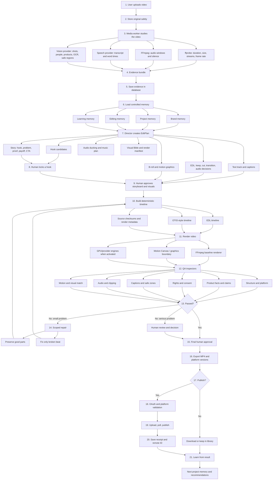

# Creozentic Editing Workflow — Explained Like You Are Ten

## The one-sentence idea

Creozentic is like a very careful video school. You give it a video. It listens to the words, watches the pictures, remembers the brand rules, makes an editing plan, builds the video, checks the homework, and asks a human before publishing.

> **The AI plans the edit. The renderer makes the file. The QA inspectors check it. A human gives final permission.**

## The complete picture



## What is the text track?

Imagine that the video has an invisible **word ruler** underneath it. Every word knows when it starts and when it ends.

Example:

| Word | Start | End |
|---|---:|---:|
| “This” | 0.00 seconds | 0.20 seconds |
| “bottle” | 0.20 seconds | 0.58 seconds |
| “keeps” | 0.58 seconds | 0.90 seconds |
| “water” | 0.90 seconds | 1.30 seconds |

The text track is used for five jobs:

| Job | What happens |
|---|---|
| Transcript | The system knows exactly what was said |
| Editing | The Director can find the important sentence |
| Captions | Words appear on screen at the correct time |
| Dead-air removal | Long silent spaces can be shortened carefully |
| Evidence | A claim can point back to the exact spoken words |

The project supports transcript-word records and can accept word timing from a speech provider. Without a speech provider, local FFmpeg can still inspect technical audio and silence, but it cannot magically understand every spoken word.

## The technologies, in simple language

| Technology | Child-friendly meaning | Job in editing |
|---|---|---|
| Next.js + React | The visible school classroom | Shows the editor screens and buttons |
| TypeScript | Labels on every box | Keeps data shapes from being mixed up |
| Prisma + PostgreSQL | The school’s organized filing cabinet | Stores projects, evidence, plans, renders, QA, and approvals |
| `ffprobe` | A measuring tape for video files | Reads duration, dimensions, codecs, streams, and frame rate |
| FFmpeg | A very strong scissors-and-glue machine | Cuts, scales, pads, encodes, mixes audio, and creates MP4 files |
| Python worker | A specialist helper | Runs media analysis and isolated open-source engines |
| Redis/BullMQ boundary | A queue of tasks | Lets long jobs wait and run safely in the background |
| AI gateway | A controlled telephone to an AI provider | Sends planning or generation requests without exposing provider code everywhere |
| Director/LLM | The film teacher | Makes a structured plan, not raw unsafe commands |
| EditPlan | The teacher’s lesson plan | Describes hooks, beats, captions, audio, B-roll, and motion |
| EDL | A cutting list | Says exactly what to keep, cut, move, caption, or protect |
| OTIO-style timeline | A standard timeline notebook | Describes clips and timing in a reproducible form |
| Motion Canvas boundary | A graphics studio | Handles animated text and designed motion when activated |
| Adopted OSS engines | Specialist guest teachers | Provide optional editing/generation capabilities behind safe boundaries |
| QA judges | Homework inspectors | Check facts, rights, sound, captions, format, and visual quality |
| Playwright | A robot user | Clicks through the frontend to test it |

## The Director and the renderer are different

This separation is very important.

The **Director** answers:

```text
What is the best opening?
Which words matter?
Which parts should stay?
Where should captions appear?
What proof is allowed?
What B-roll is safe?
What should the viewer feel next?
```

The **renderer** answers:

```text
How do I cut these exact time ranges?
How do I put this caption on the frame?
How do I lower the music?
How do I make a 9:16 MP4?
How do I encode video and audio correctly?
```

The Director does not secretly write arbitrary shell commands. The renderer does not invent creative claims.

## The EditPlan in simple pieces

```text
HOOK
  The first attention-grabbing moment.

PROBLEM
  What problem is the viewer having?

PROOF
  What source evidence shows the idea is real?

PAYOFF
  Why should the viewer care?

CTA
  What should the viewer do next?
```

The current local planner uses these five beats as a safe default. It also creates:

- an evidence-linked EDL;
- caption and text-track instructions;
- audio ducking instructions so music becomes quieter while speech is playing;
- B-roll rules that prefer verified or rights-cleared media;
- motion graphics such as kinetic captions, proof callouts, and CTA cards;
- a visual bible for colors, fonts, safe zones, and motion intensity;
- a render manifest with source checksums, renderer version, prompt version, and output formats.

## Why evidence comes first

Suppose the video shows a blue bottle. The system may safely say that the bottle is blue if the evidence supports it. If the source never proves that the bottle is waterproof, the system must not quietly invent the word “waterproof.” It must either ask for proof, mark the claim for review, or use a non-factual creative expression.

This protects the user from attractive but false videos.

## What happens when the video fails QA?

The system does not throw away everything automatically.

```text
Bad proof image
  → Keep approved hook
  → Keep approved captions
  → Keep approved audio
  → Replace only proof image
  → Render again
  → Check again
```

This is called **scoped repair**. It is like fixing one spelling mistake in homework instead of rewriting the entire page.

## What is automatic and what needs a person?

| Action | Automatic or human? |
|---|---|
| Read technical video information | Automatic |
| Store transcript/evidence records | Automatic |
| Suggest hooks and edit plans | AI-assisted |
| Lock the chosen hook | Human checkpoint |
| Approve storyboard and B-roll | Human checkpoint |
| Render the planned timeline | Automatic worker |
| Check format, captions, audio, facts, and rights | Automated judges plus human escalation |
| Repair a small known defect | Automatic within a limited scope |
| Approve final video | Human |
| Publish to a social account | Only after OAuth, platform checks, and approval |

## What is free/local and what needs activation?

Local editing can use `ffprobe`, FFmpeg, local storage, the deterministic planner, local tests, and the existing UI without paid providers. Rich transcript words, high-quality speech recognition, advanced scene understanding, generated B-roll, GPU video, and real social publishing need external services, accounts, credentials, model runtimes, or approvals.

## One tiny example

A user uploads a 60-second product video and asks for a 15-second Reel.

```text
1. The system measures the video.
2. Speech-to-text finds the useful sentence at 22–28 seconds.
3. The Director chooses it as the hook.
4. The plan keeps the proof at 35–42 seconds.
5. Captions are timed to the words.
6. Music becomes quieter while the person speaks.
7. A CTA card appears at the end.
8. FFmpeg creates a vertical MP4.
9. QA checks duration, audio, captions, facts, and rights.
10. The user approves it.
11. The system exports it and can publish it if the social account is connected.
```

## The most important safety rule

> **No video should be published just because an AI model generated it. It must pass the evidence, rendering, QA, approval, and platform gates.**

## Current status

The repository contains the editor contracts, evidence normalization, memory and skill structures, deterministic EDL/OTIO/render-manifest runtime, FFmpeg baseline renderer, QA and scoped-repair logic, frontend editor surfaces, social provider policies, tests, and external activation boundaries. Rich speech, vision, GPU, provider, and social publishing behavior remains dependent on the corresponding external account or runtime being activated.
