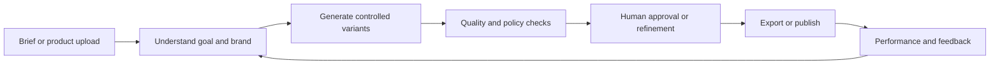
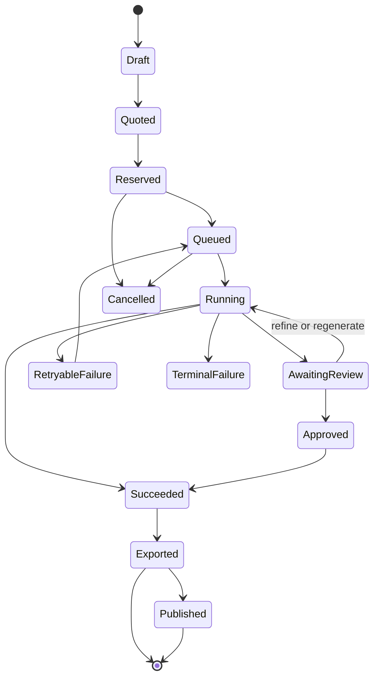
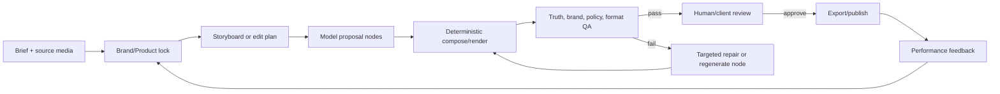

# Autozentic AI Creative SaaS

## Feature Implementation Blueprint — Customer-Outcome-First Edition

**Working product name:** Creozentic by Autozentic (renameable)  
**Owner:** Autozentic, Jaipur, Rajasthan  
**Version:** 2.0  
**Date:** 12 August 2026  
**Status:** Implementation-ready product and engineering specification

> This document converts the supplied Pletor-inspired feature checklist into an
> implementation specification and incorporates a second research pass on
> AdCreative.ai, Pletor.ai, creator/agency pain, and the failure modes of normal
> AI image/video generation. Every feature is tied to a customer outcome,
> acceptance criteria, dependencies, cost controls, and a release gate.

## 0. Scope note

The current workspace contains the business plan and checklist, but no
production application repository. This file therefore does not claim that the
features are already coded. It defines exactly what must be built and how the
team will prove that it works. When the actual repository is supplied, this
specification can be converted into schemas, tickets, APIs, UI screens, tests,
and pull requests.

All checkboxes remain unchecked until the feature exists in the product and
passes its acceptance tests.

---

## 1. Product decision in one page

### 1.1 Product promise

> Give a creator, agency, or business owner a rough idea and their
> brand/product assets; return an approved, on-brand, platform-ready campaign
> pack in minutes, without prompt engineering, repeated resizing, confusing
> model selection, or uncontrolled generation cost.

The customer is not buying an image, a video, a model, or a canvas. They are
buying a reliable path from **brief to usable result**.

### 1.2 Core loop



Every major feature must improve at least one of these measures:

1. Time from brief to first useful asset.
2. Percentage of first-run outputs accepted without a rebuild.
3. Cost per approved deliverable.
4. Number of manual tools or handoffs removed.
5. Revenue or retention created for the customer.

If a feature cannot improve one of these measures, it is not a launch priority.

### 1.3 Beachhead and expansion

The platform may eventually serve social-media creators, agencies, and business
owners, but the first paid wedge must be narrow enough to sell and learn from.

**Initial wedge:** Indian D2C/SMB brands and agencies producing product and
performance creatives, starting with furniture/home décor and then jewellery,
real estate, and tiles.

This matches Autozentic's existing context:

- Autozentic is the parent agency.
- Realzentic is the real-estate CRM product.
- The existing plan names Kosmic Furniture, Woodpeel, and diamanto.in as
  validation assets.
- Existing work is described around Furzentic, Kia, Aria, WhatsApp/Meta Graph,
  n8n, Next.js, and TypeScript.

**Why start here:** these customers have catalogues, repeat campaigns, an
obvious cost/time problem, and a reason to pay every month. A general creator
tool can later become a simpler entry experience on top of the same engine.

### 1.4 Three customer jobs

| Customer           | Job to be done                                                                        | Current loss                                                                | First outcome to sell                                                            |
| ------------------ | ------------------------------------------------------------------------------------- | --------------------------------------------------------------------------- | -------------------------------------------------------------------------------- |
| Social creator     | Turn one idea or source clip into native-looking content quickly                      | Time, consistency, and attention while adapting to every platform           | A platform-ready post/reel pack with hooks, captions, covers, and formats        |
| Agency owner/team  | Turn an ambiguous client brief into approved work without margin-destroying revisions | Producer hours, missed approvals, scattered assets, and client churn        | A branded workflow with client approval, version history, and reusable templates |
| Business/D2C owner | Turn products/offers into trustworthy content without a studio for every campaign     | Photo/video costs, slow launches, poor localization, and no designer access | An accurate, localizable product/campaign pack ready to publish                  |

Use the same engine, but use different entry language: **create a post**,
**deliver a client pack**, or **launch a product campaign**. Do not expose a
blank node graph as the first experience.

---

## 2. Research and competitive lessons

### 2.1 What Pletor proves

Pletor positions itself as creative infrastructure rather than a prompt box. Its
public product description covers multi-model access, brand context, reusable
pipelines, API/MCP access, product imagery, performance ads, AI UGC, and
creative operations. Its public pricing uses credit-based Starter, Builder,
Studio, and Enterprise tiers.

The useful Pletor capabilities are not its model count:

- **Human review:** execution pauses at a control node so a person can review,
  regenerate, or refine before the workflow continues.
- **Composer:** generated images, text, logos, and CTAs become a layered,
  finished marketing asset.
- **Prompt concatenation and list/split nodes:** brand rules, user input, and
  generated text can be combined and processed in parallel.
- **Model library:** models are curated by marketing use case instead of making
  every customer understand model differences.

Learn from these capabilities, but compete with a simpler outcome flow, stronger
product truth, India-first distribution, and transparent economics.

### 2.2 Qualitative Reddit signals

These are directional signals from public Reddit discussions, not a
statistically representative customer survey.

| Signal                           | Discussion pattern                                                                                                                                                                              | Product implication                                                                                          |
| -------------------------------- | ----------------------------------------------------------------------------------------------------------------------------------------------------------------------------------------------- | ------------------------------------------------------------------------------------------------------------ |
| “Another wrapper” scepticism     | In a side-project thread about a fast AI image generator, commenters dismissed a thin proxy to an existing model and asked what useful problem it solved.                                       | Model access alone is not a moat. Ship complete workflows, approvals, publishing, and measurable output.     |
| Manual cross-platform work       | A builder described creating a tool because posting separately to every social platform was painful; the discussion focused on platform-specific captions, formats, and publishing reliability. | Treat adaptation and publishing as one job, not an export afterthought.                                      |
| Authenticity and trust           | A 2026 discussion about Instagram content argued that synthetic media will increase and creator identity, originality, and continuity will matter more.                                         | Add authenticity mode, preserve real source media, disclose material AI edits, and avoid generic AI content. |
| Accuracy and feedback loops      | Agent/RAG discussions repeatedly describe unreliable output being abandoned and human review/feedback loops being necessary for high accuracy.                                                  | Build evaluation sets, confidence states, revision history, and human checkpoints before autonomy.           |
| Automation is often still manual | A marketing-automation discussion asked what is actually automated day to day; reporting and operational handoffs were still manual.                                                            | Show the work saved and workflow status. Generation alone is incomplete.                                     |
| Permission and trust friction    | Social publishing discussions highlight account type requirements, OAuth permissions, app review, and the need for a clear demo flow.                                                           | Build connection health, least-privilege scopes, disconnect controls, and a non-publishing export path.      |

### 2.3 Competitive conclusion

Do not claim:

> “We give you every new image and video model.”

Claim:

> “We turn your brief and product assets into an approved campaign pack that
> respects your brand, preserves product truth, fits every channel, and can be
> delivered or published without the usual manual work.”

### 2.4 Match, avoid, surpass

| Capability           | Market lesson                                        | Autozentic decision                                                       |
| -------------------- | ---------------------------------------------------- | ------------------------------------------------------------------------- |
| Multi-model routing  | Valuable internally, confusing as a user-facing menu | Match internally; expose outcomes and quality/cost modes                  |
| Brand memory         | Necessary for repeatability                          | Match with structured rules and evidence, not only a vague prompt         |
| Human review         | Necessary for reliable creative work                 | Surpass with review links, WhatsApp approval, comments, and audit history |
| Composer             | Removes final design handoff                         | Match early for fixed templates; add constrained freeform later           |
| Node canvas          | Powerful for experts, heavy for ordinary users       | Delay full canvas until fixed workflows are proven                        |
| Batch generation     | Direct economic value for catalogue teams            | Build early                                                               |
| Social publishing    | Strong value but API risk                            | Make export reliable first; publishing is an opt-in connector             |
| Performance feedback | Long-term moat                                       | Capture data from first publishing integration; optimize later            |
| Custom fine-tuning   | Expensive and often unnecessary early                | Build only for a funded enterprise use case                               |

---

## 3. Non-negotiable product principles

1. **Outcome before model.** The user chooses goal, channel, audience, and
   constraints. The router chooses the model.
2. **Brief before prompt.** Guided inputs are the default; advanced users may
   inspect or edit the generated prompt.
3. **Product truth is an invariant.** In product-lock mode, original product,
   logo, packaging text, dimensions, and colours cannot silently change.
4. **Human control before public publishing.** Default path is draft -> review ->
   approval -> publish.
5. **Cost is visible before work starts.** Show expected units, time, and
   expensive model/video choices before confirmation.
6. **Every generation is recoverable.** Users see progress, retry a node, cancel,
   restore a version, and understand charges.
7. **Use real media where authenticity matters.** AI enhances and packages
   human/brand material; it does not replace every human signal.
8. **Tenant isolation is never optional.** Every asset, rule, run, review,
   integration, and ledger entry is workspace-scoped.
9. **Features are measurable.** Each shipped feature needs success, failure, and
   owner-visible metrics.
10. **Do not hide complexity in a magical agent.** Show inputs, actions, cost,
    source assets, rules, and intervention points.

---

## 4. Revised feature status and build order

The supplied checklist remains the target inventory. It is reordered around
customer value and augmented with operational features required for reliability.

Legend:

- **P0:** required for a useful paid MVP.
- **P1:** build after the first workflow is used repeatedly.
- **P2:** scale/distribution capability.
- **P3:** enterprise or defensibility capability.
- **Defer:** deliberately not a launch feature.

| Status | Feature                          | Original phase | Revised priority   | Release rule                                         |
| ------ | -------------------------------- | -------------- | ------------------ | ---------------------------------------------------- |
| ☐      | Model router                     | 1              | P0                 | Capability routing, estimates, retries, fallback     |
| ☐      | Brand memory                     | 1–2            | P0                 | Structured, versioned, explainable rules             |
| ☐      | Workflow/agent engine            | 1              | P0                 | Fixed templates first; every run versioned           |
| ☐      | Canvas/chat UI                   | 1              | P0, simplified     | Brief-to-pack workspace first; chat is an input mode |
| ☐      | Credits, billing, teams          | 2              | P1                 | Immutable ledger with reservation/settlement         |
| ☐      | Node-based workflow canvas       | 2              | P1/P2              | Only after three fixed workflows have repeat usage   |
| ☐      | Composer/layout tool             | 2              | P0/P1              | Fixed templates before freeform layout               |
| ☐      | Batch catalogue/sheet generation | 2              | P0/P1              | Required for furniture/jewellery economics           |
| ☐      | Human-review checkpoint          | 2–3            | P0                 | Required before publishing/autonomy                  |
| ☐      | Multi-format export              | 2              | P0/P1              | Deterministic rendering from one approved concept    |
| ☐      | In-workflow model comparison     | 2              | P1                 | Quality/speed/cost choice with explicit billing      |
| ☐      | Guided input/brief forms         | 2              | P0                 | No prompt expertise required                         |
| ☐      | One-click localization           | 3              | P1                 | Locale, glossary, layout, and legal checks           |
| ☐      | Character/product consistency    | 3              | P1                 | Product-lock path has priority                       |
| ☐      | Chat/WhatsApp-triggered agents   | 3              | P2                 | Approval and message-window aware                    |
| ☐      | Deploy-as-app                    | 3–4            | P2                 | Version-pinned, scoped workflows only                |
| ☐      | Logic/data nodes                 | 3–4            | P1/P2              | Typed branching after real needs appear              |
| ☐      | Google Drive input/output        | 3              | P2                 | OAuth, folder mapping, idempotent sync               |
| ☐      | Lip-sync/native audio-in-video   | 4              | P3                 | Only after video demand and margin are proven        |
| ☐      | Performance-informed generation  | 4              | P2                 | Capture outcome data from the beginning              |
| ☐      | Ad/social nodes                  | 4–5            | P2                 | Export first; publish with permissions/receipts      |
| ☐      | Competitor monitoring agent      | 5              | P3                 | Permitted sources only; no unlawful scraping         |
| ☐      | Agent/template marketplace       | 5              | P3                 | Requires library, moderation, and support            |
| ☐      | Upscaling/video merge            | 4–5            | P1 static/P2 video | Static delivery quality precedes cinematic editing   |
| ☐      | Scheduled/API-triggered batches  | 5              | P2                 | Idempotency, quotas, approval, failure alerts        |
| ☐      | Custom brand-tuned model         | 5+             | P3                 | Funded benchmark and rollback required               |

### 4.1 Critical features missing from the checklist

| Added feature                  | Why it is required                                                         |
| ------------------------------ | -------------------------------------------------------------------------- |
| Asset library and versioning   | Source of truth for products, logos, references, outputs, and old versions |
| Product catalogue/schema       | Batch generation cannot safely use filenames alone                         |
| Job queue and execution state  | Provider jobs are asynchronous and fail partially                          |
| Quality/product-integrity gate | Beautiful but wrong assets create returns and brand damage                 |
| Review inbox and comments      | Approval is a workflow, not a hidden boolean                               |
| Export packager                | Customers need correctly named, metadata-rich deliverables                 |
| Usage/cost observability       | Retries and provider cost can silently destroy margin                      |
| Permissions and audit log      | Agencies need client separation and proof of approval                      |
| Integration health             | OAuth tokens expire and scopes change                                      |
| Privacy/IP/consent controls    | Faces, voices, logos, client work, and assets need clear rules             |
| Evaluation harness             | Provider/model changes must be detected before customers find them         |
| Notifications                  | Long-running jobs need status updates, not a spinner                       |

The first engineering sprint must include these foundations alongside the first
visible creative workflow.

---

## 5. Canonical customer workflows

### 5.1 Creator: idea to publishable pack

1. Select **Create a post/reel pack**.
2. Enter goal: announce, educate, launch, sell, or build trust.
3. Add source media, talking points, audience, language, and CTA.
4. Select target platforms.
5. Receive a few concepts with hook, format, estimated time, and cost.
6. Select one; generate the pack.
7. Review source media, changes, captions, cover, safe-area preview, and
   disclosure status.
8. Approve, edit, export, or schedule.

### 5.2 Agency: brief to client approval

1. Create a client workspace and brand.
2. Send a simple brief link or WhatsApp prompt.
3. Validate missing assets, claims, audience, language, and deadline.
4. Create a project with versioned outputs.
5. Producer reviews internally and sends a review link.
6. Client comments on an asset/frame/line and approves or requests revision.
7. Export a named pack and delivery manifest; publish only after confirmation.
8. Record time saved, revisions, provider cost, and margin by client.

### 5.3 Business/D2C: catalogue to campaign

1. Upload a product image or import a catalogue.
2. Confirm SKU, title, price, material, dimensions, variants, claims, and
   prohibited changes.
3. Choose listing hero, lifestyle scene, sale, carousel, or short video.
4. Select a brand-approved style.
5. Run a small preview batch and show full-batch cost.
6. Approve the style; run the catalogue batch.
7. Flag unreadable text, wrong colour, duplicate scenes, missing products, and
   marketplace violations.
8. Export a named folder/ZIP or push to a connected store/Drive.

### 5.4 First useful result rule

The first screen must help the user decide. It must show:

- What input is missing.
- What the workflow will produce.
- How long it should take.
- How much it will cost.
- Which brand/product rules will be applied.

---

## 6. Feature-specification format

For every feature in the next section, engineering must document:

1. Customer outcome.
2. Minimum shippable scope.
3. Data and permission requirements.
4. Failure and recovery behaviour.
5. Acceptance tests.
6. Success metric and cost owner.

The following specifications are the minimum implementation contract.

---

## 7. Detailed feature specifications

### A. Core platform — P0 foundation

#### A1. Model router

**Outcome:** the customer gets the best compatible result without understanding
provider-specific APIs or model names.

**Build**

- Define a provider-neutral capability contract for image generation/editing,
  text, speech, video, embeddings, moderation, and rendering.
- Register providers through adapters and configuration; never scatter provider
  calls through business logic.
- Store capabilities: inputs, reference-image support, dimensions, aspect
  ratios, latency range, safety restrictions, region, pricing formula, rate
  limit, and reliability score.
- Route by use case, quality mode, latency budget, cost budget, and required
  capability.
- Implement timeout, exponential backoff, idempotency, fallback, and a
  dead-letter queue.
- Persist provider request ID, model/version, input hash, output hash, raw
  usage, raw cost, and error class.

**Acceptance tests**

- A workflow changes provider/model through configuration only.
- An incompatible model is rejected before credits are spent.
- A retry cannot create duplicate billing or duplicate output records.
- A provider outage uses a compatible fallback or gives a clear user action.
- The UI exposes fast, balanced, and quality modes rather than an uncurated
  model list.

**Defer:** exposing every new model or promising that one model is always best.
The capability registry must support model deprecation.

#### A2. Brand memory

**Outcome:** repeated outputs look and sound like the same brand without
re-explaining it every time.

**Minimum profile**

- Brand name, category, audience, locations, and preferred languages.
- Light/dark logo assets and placement rules.
- Colour palette, allowed/forbidden colours, and contrast requirement.
- Typography choices and fallback fonts.
- Tone, vocabulary, preferred words, prohibited words, and claim-sensitive terms.
- Tagged visual references for products, lifestyle, people, texture, composition,
  lighting, and “do not imitate.”
- Layout rules: logo safe area, CTA style, margins, safe zones, aspect ratios.
- Product truth rules: what may never change.
- Legal/disclosure rules: disclaimers, offer validity, and AI disclosure.
- Approved/rejected examples with reusable reviewer reasons.

Use structured fields first. Add semantic retrieval only after search failures
are observed.

**Acceptance tests**

- The user previews the exact rules applied to a run.
- Every output records the brand-profile version.
- Profile changes do not rewrite old outputs.
- A reviewer can approve, reject, or approve-with-correction.
- Tenant A cannot retrieve Tenant B's rules, assets, embeddings, or outputs.

#### A3. Workflow/agent engine

**Outcome:** a proven result is repeatable by a non-technical operator.

**Minimum design**

- Versioned typed DAG with nodes having typed inputs/outputs, config schema,
  capability requirements, timeout, retry policy, cost estimate, and approval
  policy.
- Deterministic steps (resize, OCR, layout, ZIP) are separate from
  probabilistic AI steps.
- Immutable workflow versions; every run points to exactly one version.
- Pause at review, resume, retry one node, cancel, and branch to refinement.
- Complete execution trace with inputs, outputs, warnings, and provider calls.

**Initial templates**

1. Product photo to product-preserving lifestyle variants.
2. Product/catalogue row to marketplace listing pack.
3. Brief to platform-specific copy plus static social creatives.
4. Real source video to hook, captions, cover, safe-area, and platform exports.

**Acceptance tests**

- The same saved workflow can run twice with separately traceable outputs.
- A failed node can retry without re-running successful deterministic work.
- Cancellation stops queued work and releases reserved units per policy.
- A workflow cannot publish unless its review policy is satisfied.

#### A4. Canvas/chat UI

**Outcome:** the customer can request a result naturally and understand what
will happen.

**Minimum design**

- Brief-to-pack workspace: goal, audience, assets, brand, channel, language,
  CTA, constraints, and output count.
- Conversational input that converts messages into typed fields, followed by a
  confirmation screen.
- Progress timeline with node status, expected time, and cost.
- Results grid with compare, select, refine, approve, and comment.
- Mobile-first review link for clients without a full account.
- “Why this output” panel: assets, brand version, model class, transformations,
  and warnings.

**Acceptance tests**

- A new user runs an initial template without writing a prompt.
- A draft survives browser refresh and connection loss.
- The UI never reports completion before storage and validation finish.
- A client can review a pack over a mobile connection and download previews.

#### A5. Credits, billing, and teams

**Outcome:** customers understand charges; Autozentic protects margin; agencies
can separate clients.

**Minimum design**

- Separate provider-cost accounting from the user-facing plan.
- Immutable ledger states: reserve, consume, release, refund, adjustment, and
  expiry.
- Quote expensive work before starting; planning/previews are cheaper than
  final video.
- Webhook-driven subscriptions, top-ups, invoices, failed payment, upgrades,
  downgrades, cancellation, and reconciliation.
- Workspace, membership, role, and client/project boundaries.
- Plan quotas only where they protect reliability.

**Recommended billing rules**

- Show an understandable action or campaign-pack estimate first.
- Keep image and video cost classes separate internally and visibly.
- Never charge twice for a failed/retried provider call.
- Warn before expiry; consider capped rollover for paid customers.
- Give an explicit refund/retry-credit policy.

**Acceptance tests**

- Duplicate payment webhooks cannot grant duplicate units.
- Duplicate generation requests cannot consume one reservation twice.
- Every ledger entry reconciles to a run, provider call, or payment.
- A member cannot access another client's workspace.
- An admin can export usage, cost, and invoice history.

#### A6. Asset library and catalogue (added foundation)

**Outcome:** the system has a trustworthy source of truth.

**Minimum design**

- Asset types: original, reference, product, logo, font, generated, approved,
  rejected, export, and published.
- Immutable original uploads; transformations create versions.
- Product record: SKU, title, description, price, material, dimensions, variant,
  source asset IDs, claim restrictions, and lock mode.
- Content hash, MIME validation, malware scan, dimensions, EXIF policy, and
  duplicate detection.
- Search by workspace, brand, campaign, SKU, status, locale, and date.

**Acceptance tests**

- A workflow cannot use an asset from another workspace.
- Users can restore the source and inspect every derivative.
- Batch validation reports errors before generation begins.
- Deletion supports soft-delete, export-before-delete, and full purge.

#### A7. Quality, integrity, and safety gate (added foundation)

**Outcome:** the output is attractive without being misleading or unsafe.

**Minimum design**

- Product-lock path: segment/mask the real product, generate the environment,
  then composite with matched perspective, light, and shadow.
- OCR/text checks for packaging, logos, prices, and disclaimers.
- Compare source/output product region for colour, geometry, required marks, and
  confidence; flag instead of claiming perfection.
- Brand checks for forbidden colours, missing logo, wrong CTA, claims, and
  disclaimers.
- Safety moderation for text, image, video, faces, and voice where relevant.
- Low-confidence output is review-blocked.
- Preserve an AI-generated/edited metadata flag when required.

**Acceptance tests**

- A versioned benchmark exists before public launch.
- The benchmark catches seeded distortions and unreadable text.
- Low-confidence output cannot auto-publish.
- A reviewer override requires an auditable reason.

### B. High priority — P1 revenue workflows

#### B1. Node-based workflow canvas

**Outcome:** advanced users can modify a proven workflow without engineering.

**Minimum design**

- Typed DAG editor with node forms, ports, validation, zoom/pan, versioning,
  test-run mode, and run history.
- Safe initial nodes: input, brand context, product lookup, prompt/template,
  image generation, image edit, text generation, condition, split/list, merge,
  human review, composer, and export.
- Prevent cycles, unsupported connections, hidden network calls, and unbounded
  loops.
- Allow a creator to publish a locked client template.

**Acceptance tests**

- A non-developer clones, changes, validates, test-runs, and publishes a
  version.
- A workflow version is immutable once a run starts.
- Every node shows required permissions and estimated cost.

**Release rule:** wait until three fixed workflows have repeated usage.

#### B2. Composer/layout tool

**Outcome:** a concept becomes a finished ad without routine Canva/Figma work.

**Minimum design**

- Template-first layout engine with locked brand elements and editable slots.
- Inputs: background, product, headline, subhead, offer, logo, CTA,
  disclaimer, and badge.
- Safe area, minimum font size, max line count, contrast, overflow, and
  platform-dimension constraints.
- Create variants by swapping content, not regenerating the whole image.
- Deterministic image and video-overlay rendering from one schema.

**Acceptance tests**

- Same inputs render pixel-stable output.
- Text never silently overflows or becomes illegible.
- Client users cannot move brand-locked elements.
- Localization keeps layout rules while adapting copy length.

#### B3. Batch generation from catalogue/sheet

**Outcome:** a 200-SKU catalogue can be processed without manual repetition.

**Minimum design**

- CSV/XLSX import, column mapping, validation preview, and row-level errors.
- Folder/drop-zone mapping for product images.
- Dry run showing item count, estimated duration, cost, and missing data.
- Concurrency limits, pause/resume, per-row retry, and partial completion.
- Deterministic output names: SKU, campaign, locale, platform, version.
- Export manifest with success, warning, failure, and cost per row.

**Acceptance tests**

- One failed row cannot fail the entire batch.
- Repeating the same input/workflow is idempotent.
- The user can stop before expensive nodes begin.
- The platform never substitutes one SKU's product image for another.

#### B4. Human-review checkpoint

**Outcome:** people retain control where quality, accuracy, and brand risk matter.

**Minimum design**

- Pause node creates a review task.
- Actions: approve, reject, regenerate, edit brief, choose option, annotate,
  assign, set deadline, and return to a previous node.
- Review link with scope, expiry, optional no-login access, and comments on an
  asset/frame/line.
- Approval can require one or more roles.
- Resume is idempotent.

**Acceptance tests**

- A run cannot pass a required checkpoint without an approval event.
- Reviewer sees exact workflow, brand, and product versions.
- Rejection records a reason reusable for analysis.
- Every decision is timestamped, attributed, and audited.

#### B5. Multi-format/aspect-ratio export

**Outcome:** one approved concept becomes the correct pack for every channel.

**Minimum design**

- Platform-spec registry: dimensions, safe zones, duration, file type, caption
  limits, and known publishing constraints.
- Render from the approved composition; do not independently regenerate every
  format by default.
- Smart reflow for 1:1, 4:5, 9:16, 16:9, and selected marketplace ratios.
- Preview all outputs and flag crop, text, logo, and subtitle issues.
- Package with a manifest and per-platform copy.

**Acceptance tests**

- One approved concept exports all supported formats in a single run.
- Every file is labeled with platform, dimensions, locale, and version.
- Safe-zone and caption validation runs before download or publish.

#### B6. In-workflow model comparison

**Outcome:** users trade quality, speed, and cost intentionally.

**Minimum design**

- Comparison step takes one normalized brief and compatible models.
- Show estimated cost before the run.
- Store side-by-side outputs and objective checks.
- User selects one output to continue; billing follows the displayed policy.
- Internal auto-route mode can use evaluation scores without exposing provider
  names.

**Acceptance tests**

- Incompatible models are excluded with an explanation.
- Prompt/context normalization makes comparisons fair.
- Billing reflects actual provider calls and published policy.
- Selected output carries model/version metadata downstream.

#### B7. Guided input/brief forms

**Outcome:** the first request is complete enough to produce a useful result.

**Minimum design**

- Workflow-specific schemas, not one universal mega-form.
- Required: objective, audience, product/service, offer/claim, channel,
  language, assets, output count, deadline, and approval owner.
- Optional: visual direction, exclusions, references, camera/lighting, and model
  preference.
- Live validation, examples, saved presets, and an “I don't know” path.
- Chat-to-form extraction with user confirmation.

**Acceptance tests**

- A first-time user completes a brief in under five minutes.
- Missing product/claim data is caught before generation.
- Advanced users can inspect and edit the generated prompt.

### C. Medium priority — P2 distribution and consistency

#### C1. One-click localization

**Outcome:** one approved campaign reaches Hindi/Hinglish and other markets
without rebuilding every asset.

**Minimum design**

- Locale profile: language, script, currency, number/date formats, CTA patterns,
  prohibited translations, and formality.
- Glossary/term locks for names, prices, SKUs, and claims.
- Deterministic text overlays and layout reflow.
- Locale-specific review and disclaimer checks.
- Original remains the immutable source.

**Acceptance tests**

- Multiple locales generate from one approved campaign.
- Locked terms never change accidentally.
- Reviewer compares every locale with the source.

#### C2. Character and product consistency

**Outcome:** a campaign looks like one campaign, not unrelated AI outputs.

**Minimum design**

- Reference pack with labeled product/character images and identity rules.
- Product-lock mode for exact products; creative mode for loose inspiration.
- Store reference IDs/seeds/settings per campaign.
- Carry identity through image and video steps.
- Confidence score and review block for identity drift.

**Acceptance tests**

- Benchmark includes multiple angles, lighting, and variants.
- System flags changed logo, silhouette, colour, or character feature.
- User can deliberately start a new campaign identity.

#### C3. Chat/WhatsApp-triggered agents

**Outcome:** an owner or agency can request, review, and approve in the channel
they already use.

**Minimum design**

- Map sender to workspace and role after explicit verification.
- Convert message into a typed request; ask only for missing fields.
- Send confirmation summary, estimated cost, progress, review links, actions,
  and failure explanations.
- Outside the customer-service window, use approved templates.
- Require confirmation for destructive or publishing actions.

**Acceptance tests**

- Authorized user starts a safe workflow from WhatsApp.
- Signed, expiring actions support approve/revise.
- Out-of-window messages are templated or queued.
- Opt-out, disconnect, and audit actions work.

#### C4. Deploy-as-app

**Outcome:** a proven workflow becomes a simple client-facing tool.

**Minimum design**

- Publish a version with custom name, inputs, limits, brand, and approval policy.
- Scoped URL or embed; hide internal nodes, providers, secrets, and workspaces.
- Version pinning, owner disable, and rollback.
- Consent notice and owner contact.

**Acceptance tests**

- Client uses the deployed app without seeing the builder.
- Owner disables/rolls back immediately.
- Every run identifies the deployed version.

#### C5. Logic and data nodes

**Outcome:** repetitive rules are automated without custom code.

**Minimum design**

- Condition, switch, filter, map, split, merge, bounded loop, and prompt
  concatenation.
- Typed contracts and schema validation at each boundary.
- Safe expressions only; no arbitrary server code in client-created flows.
- Maximum loop depth, fan-out, cost, and concurrency.

**Acceptance tests**

- Validated furniture, jewellery, and real-estate rows can route differently.
- Bad rows enter an error branch with an actionable message.
- Infinite loops and uncontrolled fan-out are impossible.

#### C6. Google Drive input/output

**Outcome:** agencies use existing client folders instead of another asset
handoff.

**Minimum design**

- Encrypted OAuth connection with minimal scopes.
- Source/output folder mapping and rules.
- Content-hash sync and duplicate protection.
- Result manifest and review links in the output folder.
- Revoke, re-authorize, and token-expiry handling.

**Acceptance tests**

- Timestamp changes alone cannot duplicate processing.
- Drive failure pauses/marks a run without losing generated assets.
- Disconnect removes tokens and stops future sync.

#### C7. Lip-sync and native audio-in-video

**Outcome:** a consented UGC/avatar workflow produces coherent voice, mouth
movement, captions, music, and sound effects.

**Minimum design**

- Consent record for every real face/voice or licensed avatar.
- Script, voice, timing, shot list, captions, and audio mix as separate assets.
- Adapter for lip-sync/audio/video generation.
- Human review of identity, claims, pronunciation, and sync.
- Loudness, caption, resolution, and duration checks.

**Acceptance tests**

- Workflow refuses unconsented likeness/voice.
- Reviewer replaces script/audio without regenerating unrelated shots.
- Manifest identifies synthetic voice/avatar status where required.

### D. Future and enterprise — P2/P3

#### D1. Performance-informed generation

**Outcome:** future creative choices improve from real results, not aesthetics.

**Minimum design**

- Capture asset, campaign, platform, audience, spend window, and outcome metrics.
- Normalize metrics and separate creative effect from audience, budget,
  placement, and seasonality.
- Start with human-readable reports; only later rank templates/prompts.
- Explain recommendations and allow opt-out.

**Acceptance tests**

- Published asset maps to imported metrics with source and timestamp.
- No causal claim is made from correlation alone.
- Brand can export/delete performance data.

#### D2. Ad/social nodes

**Outcome:** approved creative reaches a campaign without copy-paste errors.

**Minimum design**

- Separate permissioned connectors.
- Export/draft first; publish only after explicit approval.
- Token health, rate limits, media requirements, caption validation, retries,
  and publish receipts.
- Official APIs only; store platform IDs and timestamps.

**Acceptance tests**

- Disconnect stops future actions.
- Publish failure is visible and retryable without duplicates.
- UI distinguishes draft, scheduled, published, failed, and externally edited.

#### D3. Competitor monitoring agent

**Outcome:** permitted public signals become useful creative hypotheses.

**Minimum design**

- Official/authorized sources and customer-provided URLs where possible.
- Store citations, retrieval time, terms, and confidence.
- Summarize themes, offers, formats, and gaps; do not copy assets or impersonate.
- Create inspiration briefs, not automatic derivative ads.

**Acceptance tests**

- Every insight has a source and timestamp.
- Deleting a source deletes derived summaries.
- Agent refuses restricted/private scraping requests.

#### D4. Agent/template marketplace

**Outcome:** safe workflows are reused without rebuilding.

**Minimum design**

- Package includes input schema, workflow version, assets, brand slots,
  permissions, cost estimate, and documentation.
- Private sharing first, public marketplace later.
- Review, malware scan, moderation, versioning, ratings, and rollback.
- Imported templates cannot access publisher secrets or private assets.

**Acceptance tests**

- Imported template runs in a sandboxed workspace.
- Owner can unpublish it.
- Users see inputs, outputs, limitations, and expected cost.

#### D5. Upscaling and video merge

**Outcome:** final files meet delivery requirements without another editor.

**Minimum design**

- Deterministic trim, merge, audio mix, captions, poster frame, and upscale.
- Preserve aspect ratio, colour profile, frame rate, and audio sync.
- Validate media before packaging.

**Acceptance tests**

- Merge is repeatable and produces a manifest.
- A failed clip cannot silently produce a broken final video.
- Replacing one clip reruns only affected steps.

#### D6. Scheduled/API-triggered batches

**Outcome:** recurring catalogue and campaign operations run reliably.

**Minimum design**

- Cron, webhook, API, and event triggers.
- Signed requests, API keys/OAuth, scopes, idempotency, quotas, and concurrency.
- Dry run, approval policy, cost ceiling, and failure notification.
- Pause/resume and replay from a checkpoint.

**Acceptance tests**

- Retrying a webhook cannot duplicate a run or charge.
- Batch stops at its configured cost/time ceiling.
- Every external trigger appears in audit history.

#### D7. Custom brand-tuned model

**Outcome:** a large brand receives measurable consistency improvement for a
high-volume use case.

**Minimum design**

- Written consent/data rights for all training/reference assets.
- Baseline benchmark against standard product-lock/reference workflows.
- Dataset/model version, evaluation split, rollback, and deletion.
- Enterprise isolation, access control, and cost allocation.

**Acceptance tests**

- Model ships only if it improves agreed quality and unit economics.
- Customer can export/delete data and disable the model.
- Model updates cannot silently change live campaign output.

---

## 8. Technical architecture

### 8.1 Recommended stack

Reuse Autozentic's existing strengths where they are real, but keep boundaries
clean:

| Layer            | Recommendation                                              | Non-negotiable rule                                               |
| ---------------- | ----------------------------------------------------------- | ----------------------------------------------------------------- |
| Web app          | Next.js + TypeScript                                        | Every request enforces workspace authorization                    |
| API              | Node.js + TypeScript                                        | Domain code never depends on provider objects                     |
| Database         | PostgreSQL                                                  | Every tenant-owned table has workspace scope and audit timestamps |
| Queue            | Redis + BullMQ or equivalent                                | Provider calls are asynchronous, retryable, and idempotent        |
| Object storage   | Cloudflare R2/S3-compatible                                 | Originals immutable; signed URLs short-lived                      |
| Rendering        | Deterministic HTML/SVG/Remotion pipeline                    | Preview and export use one composition schema                     |
| Workflow runtime | Typed fixed DAG first; custom runtime before arbitrary code | Bounded fan-out, timeout, cancellation, version pinning           |
| Auth             | Existing Autozentic auth or Auth.js/Clerk                   | Workspace membership is the authorization boundary                |
| Payments         | Razorpay India plus Stripe where needed                     | Webhook-driven; ledger is source of truth                         |
| Distribution     | Existing Kia Meta Graph/WhatsApp work                       | Connector code isolated and permission-aware                      |
| Observability    | Structured logs, traces, metrics, error tracking            | Every run/node/provider call has a correlation ID                 |

Keep these as modules in one deployable application while the team is small.
Logical boundaries matter before separate microservices do.

### 8.2 Service modules

1. **Identity/workspace:** users, organizations, roles, client workspaces, API
   keys.
2. **Asset/catalogue:** uploads, products, versions, search, signed URLs,
   retention.
3. **Brand:** profiles, references, rules, approvals, revisions.
4. **Workflow:** templates, versions, node schemas, validation, deployment.
5. **Execution:** runs, queue, node state, retries, cancellation, checkpoints,
   notifications.
6. **Model gateway:** capability registry, adapters, estimates, quotas,
   fallback, usage capture.
7. **Creative renderer:** compositions, layout, aspect-ratio exports, merge,
   manifests.
8. **Review:** tasks, comments, decisions, signed review links.
9. **Billing:** plans, subscriptions, ledger, reservations, invoices,
   reconciliation.
10. **Connectors:** WhatsApp, Drive, publishing, store imports, webhooks, token
    health.
11. **Analytics/evaluation:** integrity, brand compliance, performance data,
    benchmarks, customer metrics.

### 8.3 Model gateway contract

Domain code calls a contract like this, never an OpenAI/Google/fal SDK directly:

```ts
type CreativeCapability =
  | "image.generate"
  | "image.edit"
  | "image.reference"
  | "text.generate"
  | "video.generate"
  | "video.edit"
  | "audio.generate"
  | "audio.lipsync"
  | "moderation"
  | "upscale";

interface CreativeRequest {
  capability: CreativeCapability;
  inputAssets: string[];
  prompt: string;
  constraints: {
    aspectRatio?: string;
    outputCount?: number;
    qualityMode: "fast" | "balanced" | "quality";
    productLock?: boolean;
    locale?: string;
  };
  workspaceId: string;
  idempotencyKey: string;
}

interface CreativeResult {
  provider: string;
  model: string;
  modelVersion: string;
  outputs: Array<{
    assetId: string;
    mimeType: string;
    width?: number;
    height?: number;
    durationMs?: number;
  }>;
  usage: {
    inputUnits?: number;
    outputUnits?: number;
    providerCostMinor: number;
    currency: string;
  };
  warnings: string[];
  providerRequestId?: string;
}
```

The registry must support deprecation and capability changes. Google's current
image-generation documentation is a practical warning: it says older Imagen
models are being retired in August 2026 and recommends migrating to newer Nano
Banana models. A hard-coded model name would turn a provider change into an
outage.

### 8.4 Workflow run state machine



Every transition is authorized, persisted, and emitted as an event. The
frontend subscribes through SSE/WebSocket or polls with backoff; it must not
infer completion from an optimistic UI state.

### 8.5 Core data model

| Entity            | Important fields and invariants                                      |
| ----------------- | -------------------------------------------------------------------- |
| Workspace         | id, owner, plan, status, region, retention policy                    |
| Membership        | workspace, user, role, status, last access                           |
| Brand             | workspace, profile version, locale defaults, approval policy         |
| BrandRule         | brand, type, value, severity, source, version                        |
| Asset             | workspace, brand, type, object key, hash, MIME, status, parent asset |
| Product           | workspace, SKU, facts, variant, source asset IDs, lock mode          |
| WorkflowTemplate  | owner, visibility, category, published version                       |
| WorkflowVersion   | immutable graph, schemas, permissions, cost formula                  |
| WorkflowRun       | workspace, template version, input snapshot, state, idempotency key  |
| NodeRun           | run, node, state, attempts, input/output references, provider call   |
| ReviewTask        | run/node/asset, assignee, status, deadline, decision                 |
| Comment           | review task, asset/frame/region, author, text, resolved state        |
| OutputAsset       | run, source IDs, format, locale, quality scores, approval status     |
| Connection        | workspace, provider, encrypted token reference, scopes, health       |
| PublishJob        | output, connection, platform object ID, status, receipt              |
| CreditAccount     | workspace, plan, balance, reserved, unit class                       |
| LedgerEntry       | immutable debit/credit, reason, run/payment reference                |
| ProviderCost      | provider call, raw usage, cost, retry flag, model version            |
| PerformanceMetric | published asset/campaign, metric, period, source, attribution        |
| AuditEvent        | actor, action, target, timestamp, request correlation ID             |
| ConsentRecord     | subject, asset/voice/face, purpose, scope, expiry, revocation        |

**Database rules**

- Every workspace-owned table includes workspace_id. Enforce authorization in
  service code and database policies where possible.
- Use soft-delete for user-visible objects; hard-delete only via explicit purge.
- Store snapshots of the brief, brand version, product facts, and workflow
  version for every run.
- Never put provider secrets or raw access tokens in asset metadata.

### 8.6 Cost and credit transaction

1. Validate the request and calculate an estimate.
2. Reserve maximum expected user units before expensive work.
3. Enqueue with an idempotency key.
4. Record provider calls and actual raw cost.
5. On success, settle actual usage and release unused reservation.
6. On cancellation before provider start, release reservation.
7. On retryable failure, do not double-charge the user; track provider cost.
8. On Autozentic/provider failure, refund units or provide an explicit retry
   credit according to the published policy.
9. Reconcile provider invoices and the internal ledger daily.

### 8.7 Product-preserving image pipeline

Free-form image generation is often wrong for product imagery. Use two modes.

**Product-lock mode**

1. Validate and normalize the original product image.
2. Segment/mask the product and record source geometry.
3. Generate or select the environment/background.
4. Composite the product with matched perspective, light, and shadow.
5. Run OCR and image-difference checks on the product region.
6. Flag low-confidence results for review.

**Creative mode**

1. Use reference images and a controlled prompt.
2. Label that shape/material/details may be stylized.
3. Never use it for marketplace hero images or regulated claims without review.

This distinction is a strong advantage over a generic prompt box.

---

## 9. API and event contract

Keep the first public API small and stable:

| Endpoint                       | Purpose                                   |
| ------------------------------ | ----------------------------------------- |
| POST /v1/workspaces            | Create workspace                          |
| POST /v1/brands                | Create/update structured brand profile    |
| POST /v1/assets/upload-intent  | Issue signed upload URL and metadata      |
| POST /v1/products/import       | Validate catalogue rows                   |
| GET /v1/workflows              | List workspace templates                  |
| POST /v1/workflows/:id/quote   | Return inputs, time, cost, and warnings   |
| POST /v1/runs                  | Start an idempotent workflow run          |
| GET /v1/runs/:id               | Get status, outputs, warnings, and trace  |
| POST /v1/runs/:id/cancel       | Cancel queued/running run                 |
| POST /v1/reviews/:id/decision  | Approve, reject, refine, or assign        |
| POST /v1/exports               | Render/export an approved pack            |
| POST /v1/connections/:provider | Start connector OAuth                     |
| POST /v1/publish-jobs          | Publish approved output with confirmation |
| GET /v1/usage                  | Usage, cost, and ledger report            |

Core events:

- brief.created
- run.quoted
- credits.reserved
- run.queued
- node.started
- node.completed
- node.failed
- review.requested
- review.decided
- asset.approved
- export.completed
- publish.succeeded
- publish.failed
- credits.settled
- connection.expiring

Every event needs schema version, workspace ID, actor, correlation ID, and
idempotency key. Unstructured status strings are not an audit trail.

---

## 10. Quality and evaluation system

### 10.1 Evaluation set

Create a versioned, permissioned benchmark before public launch:

- 25 furniture/home décor products with different materials, reflections,
  patterns, and angles.
- 25 jewellery/metallic products with fine details and reflective surfaces.
- 15 property images with text/claims and local context.
- 15 packaging/label images where text must remain exact.
- 10 creator source videos with talking-head, low-light, noisy, and vertical
  examples.

For each item, record expected product facts and prohibited transformations.

### 10.2 Human rating rubric

Score every output from 1–5 on:

1. Product identity and geometry.
2. Text/logo legibility.
3. Brand alignment.
4. Composition and platform fit.
5. Authenticity/trust.
6. Claim and policy safety.
7. First-pass usability.

Use blind review for model comparisons. “Looks beautiful” is not enough; an
inaccurate listing image is a failure.

### 10.3 Launch quality gates

Initial targets to validate:

- At least 90% of runs reach a clear terminal state rather than hanging.
- At least 95% of successful outputs have retrievable files and metadata.
- Zero cross-tenant asset exposure in automated authorization tests.
- No duplicate user charge on retries, duplicate webhooks, or refresh.
- At least 70% first-run approval for the first narrow workflow after tuning.
- Product-lock tests catch intentionally seeded major distortions; unresolved
  minor failures remain review-blocked.
- First useful preview appears in roughly 60–90 seconds for a standard image
  workflow, subject to provider queue time.
- A standard approved catalog/social pack is delivered in roughly 10 minutes.

---

## 11. Security, privacy, IP, and trust

### 11.1 Policy decisions before paid work

- Customer owns uploaded assets and receives the agreed rights to deliverables,
  subject to provider terms and applicable law.
- Autozentic does not train a shared model on customer assets without explicit
  written consent.
- Define retention for originals, generated assets, prompts, logs, and backups.
- Provide export and deletion controls.
- Obtain consent for real faces, voices, testimonials, and likeness.
- Keep provenance: sources, transformations, providers, versions, approver, and
  publish receipt.
- Define who is responsible for factual claims, prices, regulated language, and
  marketplace compliance.
- Disclose AI generation/editing where the customer, platform, or law requires.

This is product policy, not legal advice. An Indian technology/privacy lawyer
should review agreements, DPA, consent language, and IP wording before
enterprise sales.

### 11.2 Security controls

- Encrypt data in transit and at rest.
- Encrypt provider/OAuth secrets separately from application data.
- Use short-lived signed URLs and private buckets.
- Add malware scanning and MIME validation.
- Apply per-workspace rate limits and spend ceilings.
- Use least-privilege connector scopes.
- Log access/admin actions without storing secrets unnecessarily.
- Redact private prompts and PII from error reports.
- Test prompt injection through imported files and integrations.
- Maintain disaster-recovery backup and restore drills.

### 11.3 Publishing safety

Publishing requires:

1. Approved output.
2. Valid connector and permission.
3. Platform-spec validation.
4. User confirmation showing destination, timing, caption, and media.
5. Publish receipt or a clear failure.

The default product behaviour is draft/export, not autonomous public posting.

---

## 12. Roadmap with release gates

Phases are outcome gates, not calendar promises.

### Phase 0 — discovery and proof (1–2 weeks)

**Build**

- Interview 5–10 creators, agency producers, and business owners.
- Observe brief -> creation -> revision -> delivery.
- Select one paid workflow and one vertical; recommend furniture/home décor.
- Gather consented benchmark assets from Kosmic Furniture or another client.
- Price two image providers and one editor using official dated documentation.
- Define brand/profile/product schema and four workflow templates.
- Produce five sample packs manually; measure time, cost, approval, revisions.

**Exit gate**

- At least one customer agrees to test weekly.
- At least one customer says the result is worth paying for.
- The first workflow is expressible in one sentence.
- Product-lock and creative-mode risks are understood.

### Phase 1 — outcome MVP (4–6 weeks)

**Build**

- Auth/workspace/brand/assets/products.
- Model gateway with two providers and cost capture.
- Queue/run state machine, retries, cancellation, notifications.
- One product-to-lifestyle workflow plus guided brief.
- Fixed composer template and 3–5 format exports.
- Review/approve/reject/refine.
- Basic quality/product-integrity checks.
- Internal usage ledger; manual billing is acceptable.

**Exit gate**

- Internal team runs the workflow on real client assets.
- A client completes a run without developer intervention.
- No duplicate charges or cross-tenant access in tests.
- At least 10 real runs are reviewed and failure reasons categorized.

### Phase 2 — paid beta and catalogue economics (4–6 weeks)

**Build**

- Catalogue/CSV batch with dry run and partial retry.
- Brand editor and approved/rejected examples.
- Composer templates and multi-format packager.
- Billing plans, top-ups, invoices, webhooks, and reconciliation.
- Team roles and client review links.
- Model comparison for selected use cases.
- Cost and margin dashboard.

**Exit gate**

- 3–5 paying beta accounts.
- At least one account runs a repeat batch.
- Per-approved-asset cost and margin are known.
- Customers prefer the workflow to the previous manual process.

### Phase 3 — distribution and localization (4–6 weeks)

**Build**

- Hindi/Hinglish and selected locale profiles.
- WhatsApp request/status/review/approval.
- Google Drive input/output.
- Product/character consistency.
- Logic/data nodes behind safe schemas.
- Export-first Meta/Instagram integration.

**Exit gate**

- A client requests, reviews, and approves from WhatsApp.
- Two locales complete a campaign without layout rebuild.
- Connector failures are visible and recoverable.

### Phase 4 — publishing, video, and feedback (6–8 weeks)

**Build**

- Official social publishing after app review and permission testing.
- Scheduled/API runs with cost ceilings.
- Deterministic video merge, captions, and basic audio.
- Lip-sync only for consented approved use cases.
- Performance data import and human-readable reports.
- Deploy-as-app for stable pinned workflows.

**Exit gate**

- Approved publishing has receipts and no silent duplicates.
- Video margin and turnaround are acceptable.
- At least one client changes a workflow using performance data.

### Phase 5 — defensibility (ongoing)

Build only when demand pays for it:

- Private workflow sharing, then marketplace.
- Permitted competitor intelligence.
- Performance-informed routing.
- White-label agency workspaces.
- Enterprise SSO/audit/data-region controls.
- Custom brand model with a funded benchmark.

---

## 13. Metrics and revenue instrumentation

### 13.1 North-star

**Approved campaign packs delivered per active workspace per month**, guarded by
**cost per approved pack**.

Generated but never approved, downloaded, or published is not customer value.

### 13.2 Activation and quality

- Time to first useful output.
- Guided-brief completion rate.
- First-run review/approval rate.
- Regeneration count and reason.
- Product-integrity failure rate.
- Text/logo error rate.
- Review turnaround time.
- Number of manual tools used after export.

### 13.3 Economics and retention

- Provider cost per run and approved output.
- Failed/retried call cost.
- Gross margin by workflow, model, and plan.
- Reservation leakage and refund rate.
- Storage/delivery cost per workspace.
- Weekly repeat runs and monthly approved packs.
- Reuse of saved brands/templates.
- Paid conversion and churn reason.

### 13.4 Segment-specific value

| Segment      | Proof of value                                                               |
| ------------ | ---------------------------------------------------------------------------- |
| Creator      | Time from source media to publishable pack; posts shipped per week           |
| Agency       | Turnaround, revisions/client pack, producer hours saved, gross margin        |
| D2C/business | Cost per product asset, catalogue throughput, launch time, listing readiness |

---

## 14. Testing strategy

### Unit tests

- Brief validation and prompt construction.
- Brand-rule precedence and versioning.
- Cost quote, reservation, settlement, refund, and rounding.
- Workflow graph validation and bounded loops.
- Aspect-ratio and safe-zone calculations.
- Locale glossary and locked-token handling.
- Workspace permission checks.

### Integration tests

- Provider adapter contract fixtures.
- Queue retry, timeout, cancellation, and dead-letter handling.
- Storage signed URLs and deletion.
- Payment webhook deduplication and plan changes.
- OAuth expiry/reconnect/disconnect.
- WhatsApp window/template selection.
- Drive hash/idempotency sync.
- Publish receipt and duplicate prevention.

### End-to-end tests

1. Workspace -> brand -> product -> brief -> run -> review -> export.
2. Retry a failed provider node without duplicate billing.
3. Batch 100 rows with three invalid rows and partial retry.
4. Localize a template with long Hindi/Hinglish copy.
5. Review through a mobile signed link.
6. Disconnect a connector while a run is queued.
7. Attempt cross-tenant asset access.
8. Attempt prompt injection through an uploaded document.
9. Attempt unconsented face/voice use.
10. Publish, fail, retry safely, and reconcile the receipt.

### Visual regression

Keep golden fixtures for each template, format, locale, and safe-area rule.
Render in a stable environment and investigate layout drift before release.

### Provider-change evaluation

Run the benchmark set on every provider/model version change. A model update
that improves aesthetics but worsens product integrity must not be promoted
automatically.

---

## 15. Ticket-ready first backlog

### Sprint 0: decisions and fixtures

- [ ] Choose first paid workflow and customer cohort.
- [ ] Obtain consented benchmark assets and expected product facts.
- [ ] Write privacy/IP/AI disclosure policy.
- [ ] Create capability/cost registry for two image providers and one editor.
- [ ] Define workspace roles and tenant-isolation rules.
- [ ] Create event names and correlation-ID convention.

### Sprint 1: vertical slice

- [ ] Workspace/brand/product schema.
- [ ] Signed asset upload and immutable originals.
- [ ] Guided product-creative brief.
- [ ] Model gateway adapter contract.
- [ ] Queue/run state machine.
- [ ] One product-lock workflow.
- [ ] Basic output preview and review decision.

### Sprint 2: reliable delivery

- [ ] Retry/cancel/dead-letter path.
- [ ] Cost quote/reservation/settlement.
- [ ] Composer template and deterministic render.
- [ ] Multi-format export packager.
- [ ] Quality/OCR/product-integrity warnings.
- [ ] Notifications and run history.
- [ ] Evaluation harness and first benchmark report.

### Sprint 3: paid beta

- [ ] CSV/catalogue import and dry run.
- [ ] Batch concurrency and partial retry.
- [ ] Brand profile editor and rule versioning.
- [ ] Client review link and comments.
- [ ] Razorpay/Stripe webhook billing.
- [ ] Cost/margin dashboard.
- [ ] Onboard first paying beta customers.

### Sprint 4: distribution

- [ ] Hindi/Hinglish locale profile.
- [ ] WhatsApp request and approval.
- [ ] Google Drive connector.
- [ ] Product consistency reference pack.
- [ ] Export-first social integration.

### Explicitly excluded from the first four sprints

- [ ] Full infinite canvas.
- [ ] Public template marketplace.
- [ ] Custom fine-tuned models.
- [ ] Unreviewed autonomous publishing.
- [ ] Competitor scraping.
- [ ] Large avatar/lip-sync catalogue.
- [ ] “Support every model” marketing claims.

---

## 16. Research sources and implementation references

### Product and competitor references

- [Pletor product overview](https://www.pletor.ai/)
- [Pletor pricing](https://www.pletor.ai/pricing)
- [Pletor human review node](https://docs.pletor.ai/ai-studio/advanced-nodes/human-review)
- [Pletor Composer node](https://docs.pletor.ai/ai-studio/advanced-nodes/composer)
- [Pletor prompt concatenator](https://docs.pletor.ai/nodes/logic-nodes/prompt-concatenator)
- [Pletor split/list selector](https://docs.pletor.ai/ai-studio/advanced-nodes/split-text-and-list-selector)
- [Pletor image-model library](https://docs.pletor.ai/ai-model-library/image-models)
- [Photoroom API pricing](https://www.photoroom.com/api/pricing)
- [Photoroom product-photo scaling case](https://www.photoroom.com/blog/scaling-product-photos)
- [Flair product photography](https://flair.ai/)
- [Creatify AI ad generator](https://creatify.ai/)
- [Canva AI](https://www.canva.com/canva-ai/)

### Official implementation references

- [Google Gemini image generation API](https://ai.google.dev/gemini-api/docs/image-generation)
- [Google Drive file creation](https://developers.google.com/workspace/drive/api/guides/create-file)
- [Google Drive file upload reference](https://developers.google.com/workspace/drive/api/reference/rest/v3/files/create)
- [Razorpay subscriptions](https://razorpay.com/docs/payments/subscriptions/)
- [Razorpay payment retries](https://razorpay.com/docs/payments/subscriptions/payment-retries/)
- [OpenAI image generation API and pricing example](https://openai.com/index/image-generation-api/)

### Reddit signals used

- [AI image-generator side-project discussion](https://www.reddit.com/r/sideprojects/comments/1q6mcis/i_built_an_ai_image_generator_in_24_hours_4_days/)
- [Creator authenticity discussion](https://www.reddit.com/r/ArtificialInteligence/comments/1q6h7uq/the_head_of_instagram_adam_mosseri_has_outlined/)
- [Cross-platform social-publishing builder profile/thread index](https://www.reddit.com/user/Level_Knowledge5472/)
- [Marketing-automation discussion](https://www.reddit.com/r/MarketingAutomation/comments/1tztx8j/what_types_of_automation_are_actually_being_used/)
- [RAG reliability discussion](https://www.reddit.com/r/Rag/comments/1hl9x4i/trying_to_build_a_rag_chat_bot_turned_into_my/)

Reddit evidence is qualitative and directional. It should guide interviews and
prototype tests, not replace Autozentic's own customer data.

---

## 17. Independent review audit — AdCreative.ai and Pletor.ai

This section was added after a second research pass on 12 August 2026. Review
sites are not a scientific sample: ratings are affected by plan, country,
support interaction, review incentives, and survivorship. We therefore use
reviews as repeated problem signals, not as proof that every customer has the
same experience.

### 17.1 AdCreative.ai — what it gets right

AdCreative.ai is a serious competitor, not merely an image-generation wrapper.
Its current site covers ad creatives, UGC videos, product and fashion
photoshoots, video, custom templates, competitor insights, creative scoring,
and agency use cases. It also claims to generate platform sizes and to use
performance data. Those are exactly the jobs that attract a creator or agency
to this category.

The positive human-review pattern is consistent: people like the speed, quick
variation generation, easy onboarding, product-photo transformations, and the
ability to get ideas without being good at prompting. G2's review page shows a
strong overall rating and repeatedly describes time saved and ease of use. The
important lesson is not “AI can replace a designer”; it is “a customer will pay
to remove blank-page and variation work.”

### 17.2 AdCreative.ai — recurring friction to design against

| Repeated signal in public reviews                                                        | What it means for the customer                                                                                 | Autozentic requirement                                                                                                                                                    |
| ---------------------------------------------------------------------------------------- | -------------------------------------------------------------------------------------------------------------- | ------------------------------------------------------------------------------------------------------------------------------------------------------------------------- |
| Output is often a starting point, not finished work                                      | The user still edits layout, copy, colour, and composition manually; the claimed speed disappears in revisions | Make editable, constrained templates and show exactly which fields can be changed. Measure first-pass acceptance, not generations.                                        |
| Limited control over fonts, element positions, colours, and creative direction           | “On-brand” is not the same as “my brand”; repeated layouts become generic                                      | Store locked design tokens and layout constraints. Never let a model redraw the logo, price, pack, or legal text.                                                         |
| Repetition and creative sameness                                                         | More variants can create fatigue rather than useful diversity                                                  | Add a similarity gate against recent approved assets and require a meaningful hook/visual difference.                                                                     |
| Video is weaker for complex stories than static output                                   | A product image turned into motion is not a complete UGC or narrative ad                                       | Build a real edit timeline, shot plan, captions, audio mix, and review checkpoints. Use generative video selectively for inserts and B-roll.                              |
| Missing or inconvenient formats, including mobile-size complaints                        | A creative that cannot be delivered in the required placement still creates work                               | Maintain a versioned channel-format registry, safe-area rules, and a preflight report for every export.                                                                   |
| Trial expiry, unexpected subscription/credit charges, cancellation, and refund confusion | Even a useful product becomes untrustworthy when the customer fears the next invoice                           | Show renewal date, plan, expected charge, credit consumption, and cancellation state in the product; use explicit confirmation and a self-serve refund/cancellation path. |
| Credit usage is hard to predict and value feels expensive                                | Customers cannot forecast campaign margin or compare models                                                    | Provide a cost preview before execution, reserve/commit/refund units transactionally, and publish a readable credit ledger.                                               |
| Support quality varies                                                                   | The customer does not know whether a blocked campaign will be resolved today                                   | Give agencies a run ID, error explanation, retry choice, status page, and a support SLA by plan.                                                                          |

The G2, Capterra, and Trustpilot pages show a mixed picture: positive comments
about speed and support sit beside complaints about customization, video,
trial/renewal charges, and refunds. Trustpilot's summary explicitly describes
both responsive staff and recurring disputes about unexpected subscription
charges and refund delays. These complaints are not evidence of deliberate
misconduct; they are evidence that billing and lifecycle UX are part of the
product experience and can damage trust even when generation works.

### 17.3 Pletor.ai — capability review and evidence gap

Pletor's own product pages describe a production environment around models:
brand context, persistent memory, reusable pipelines, canvas workflows,
API/MCP access, product imagery, performance ads, AI UGC, and creative ops.
Its pricing page makes the model-cost trade-off visible through credits and
separate team tiers. The official docs also expose human-review, Composer,
prompt/list logic, and model-library patterns. These are valuable ideas to
borrow.

The public independent-review footprint I could locate for Pletor was too thin
to use as evidence that customers are broadly satisfied or dissatisfied. That
is a validation gap, not a positive signal. Before choosing it as a benchmark,
the team should run the same ten briefs through a trial, record every retry,
credit burn, approval, and export, and interview at least five target users.
Do not repeat Pletor's marketing claims as independent proof.

The product lesson is clear even without a large review corpus: Pletor sells a
system for production, while AdCreative.ai sells speed and performance-oriented
creative output. Autozentic should combine the useful parts but win on the
last mile: accurate product representation, professional editing, agency
approvals, Indian-language and WhatsApp distribution, and billing people can
understand.

### 17.4 Competitive design decision

Do not position Creozentic as “another tool with more models.” Position it as a
**creative reliability and delivery system**:

> A brief, source media, and brand rules become a reviewed, accurate,
> platform-ready campaign pack — with the human still in control.

The durable moat is the structured brand/product data, the approved-template
library, the evaluation dataset, the revision/approval history, the publishing
connectors, and the measured relationship between creative attributes and
business outcomes. Model access is replaceable infrastructure.

## 18. Failure modes of normal AI image and video generation

“Professional” is a measurable property, not a style prompt. A raw generator
optimizes plausibility and aesthetics; a marketing production system must also
preserve identity, truth, legal text, layout, continuity, and delivery
constraints.

### 18.1 Image-generation failure map

| Failure                                                              | Typical root cause                                                                | Customer damage                                                 | Product control and acceptance test                                                                               |
| -------------------------------------------------------------------- | --------------------------------------------------------------------------------- | --------------------------------------------------------------- | ----------------------------------------------------------------------------------------------------------------- |
| Product geometry or parts change                                     | The model fills an ambiguous or occluded region from its prior                    | Furniture, jewellery, packaging, or hardware becomes misleading | Segment and lock the product; compare masks/embeddings and block material change above the configured threshold.  |
| Logo, label, SKU, price, or disclaimer is misspelled                 | Image models render text as visual texture; exact string output is not guaranteed | Lost trust, rejected ads, regulatory/commercial risk            | Render important text deterministically as SVG/HTML; OCR every raster region and require exact match.             |
| Brand colour drifts under lighting or style transfer                 | Prompt-level colour is not a design token                                         | Off-brand campaign and inconsistent catalogue                   | Use colour tokens with ΔE tolerance, palette linting, and a “locked colour” mode.                                 |
| Reference identity changes between variants                          | One reference image under-specifies viewpoint, material, and dimensions           | A catalogue appears to contain different products               | Create a multi-view reference pack, product ID, dimensions, and a product-consistency score.                      |
| Shadows, reflections, hands, and small details look physically wrong | The model has weak scene geometry and occlusion reasoning                         | Low-end or obviously synthetic appearance                       | Run saliency/detail checks; route high-risk scenes to real-photo edit or human review.                            |
| Composition is attractive but commercially unusable                  | Aesthetic objective conflicts with CTA, focal hierarchy, or safe areas            | Text overlaps the product or is cut off on a placement          | Use template slots, safe-area geometry, and channel preflight before approval.                                    |
| Generic “AI look” and repetition                                     | Same model priors, prompts, and popular styles                                    | Audience fatigue; creators lose distinctiveness                 | Use real source media, controlled art direction, similarity search, and hook/angle diversity rules.               |
| Prompt sensitivity and non-determinism                               | Small wording/model/seed/provider changes alter output                            | Hard to reproduce a client-approved result                      | Persist prompt, seed, model version, inputs, and config; permit deterministic re-render of the final composition. |
| Aspect ratio or crop loses the subject                               | The model was not conditioned on the final placement                              | Stories, reels, and feeds require manual redesign               | Generate a master asset, compose each ratio separately, and test focal point/safe area per channel.               |
| Unsupported claims or unsuitable imagery                             | Copy and image generation are not policy-aware                                    | Account, legal, or reputation risk                              | Claims registry, prohibited-terms list, moderation, and a human approval state before publishing.                 |
| Copyright, consent, or provenance is unclear                         | Training/source rights and AI edits are not recorded                              | Client disputes and platform disclosure problems                | Asset licence/consent fields, audit log, visible AI disclosure policy, and export metadata.                       |

Current model documentation reinforces these constraints. Google's image API
warns that exact output counts and some text behavior are not guaranteed and
that providers/models change over time. Pletor's model notes themselves call
out variance, prompt sensitivity, aspect-ratio limits, and weaker product or
character consistency for particular models. Treat model output as an
untrusted proposal until the quality gate passes.

### 18.2 Video-generation and editing failure map

| Failure                                                           | Why it happens                                                                | Customer damage                                                | Product control and acceptance test                                                                                          |
| ----------------------------------------------------------------- | ----------------------------------------------------------------------------- | -------------------------------------------------------------- | ---------------------------------------------------------------------------------------------------------------------------- |
| Temporal flicker or texture popping                               | Frame-wise denoising and imperfect temporal attention                         | Looks amateurish in a paid ad; distracts from the product      | Track optical-flow/feature stability in protected regions; reject clips above a flicker threshold.                           |
| Product/face/garment identity drift                               | Viewpoint changes expose details not present in the reference                 | Product changes shape or creator looks like a different person | Use multi-view references, face/product masks, shot-length limits, and per-shot identity scoring.                            |
| Object deformation or impossible physics                          | Text-to-video learns visual correlations rather than a complete 3D scene      | Hands, liquids, furniture, and interactions look fake          | Prefer real footage for claims/interactions; use generative clips only where a human approves the shot.                      |
| Camera and scene continuity breaks                                | Each clip is generated independently                                          | A multi-shot ad feels stitched together                        | Plan a shot list with persistent scene/wardrobe/lighting IDs; carry the last approved frame and continuity metadata forward. |
| Fine text and logos dissolve or mutate                            | Video models are poor at stable small text                                    | Brand or offer is unreadable after animation                   | Keep typography outside the generated video; overlay deterministic text/logo layers after generation.                        |
| Lip-sync, voice, and audio timing mismatch                        | Separate audio/video models and variable duration                             | UGC feels fake and viewers lose trust                          | Generate/ingest a time-coded transcript; use forced alignment, phoneme checks, loudness targets, and human preview.          |
| Generic UGC performance                                           | Avatar or script has no real lived context and every tool uses the same hooks | Low trust, low watch time, “AI ad” comments                    | Start with creator footage or consented avatar, store persona/voice rules, and test multiple human-sounding hooks.           |
| Caption overlap, unsafe margins, or localisation errors           | Text is added after the model without channel constraints                     | Important words are hidden by UI chrome or mistranslated       | Use a subtitle/layout engine with per-platform safe areas, language QA, and line-length tests.                               |
| Overlong or expensive retries                                     | A failed clip may consume provider time/credits                               | Margin loss and unpredictable delivery date                    | Stage cheap storyboard/preview renders, reserve credits, cap retries, and show cost before high-quality generation.          |
| Provider deprecation, rate limits, watermarks, or licence changes | The platform depends on third-party models                                    | A working workflow suddenly fails or exports are unusable      | Capability registry with health/terms/version, provider fallback, queue backoff, and a customer-visible incident log.        |

Independent research also treats identity drift, geometric distortion, and
temporal consistency as open problems rather than solved properties. The
ConsID-Gen and GeoFlow work specifically benchmark appearance/geometry and
temporal consistency; TC-Bench reports that contemporary video generators still
struggle with compositional changes. The implementation consequence is to
compose professional overlays and claims deterministically and to keep each
generative shot short, reference-conditioned, and reviewable.

### 18.3 Source-of-truth hierarchy

When sources disagree, the renderer and QA system must use this order:

1. **Locked facts:** approved product asset, SKU, price, offer, legal copy,
   dimensions, logo, colour tokens, consent/rights.
2. **Campaign brief:** audience, objective, channel, language, tone, hook, and
   required call to action.
3. **Approved template:** geometry, typography, safe areas, motion grammar, and
   editable slots.
4. **Model proposal:** background, pose, lighting, B-roll, visual metaphor, or
   optional scene details.
5. **Human decision:** accept, edit, regenerate a node, or reject.

The model must never override levels 1–3 silently. This single rule prevents a
beautiful but inaccurate product ad from being treated as a finished asset.

## 19. Revised product thesis and experience design

### 19.1 Four product modes

Build one production engine with four focused entry points rather than one
generic prompt screen:

1. **Authentic Edit:** upload a creator or customer clip; find the hook,
   remove silences, add captions, music, b-roll, cover, and platform exports.
2. **Product-Lock Studio:** upload a catalogue product; create controlled scene
   variants while keeping the real product, text, and colour intact.
3. **UGC Ad Studio:** create a brief, script, storyboard, creator/voice choice,
   evidence/claims, overlays, and multiple hooks; use real footage or a
   consented avatar before considering fully synthetic footage.
4. **Brand Campaign System:** turn one approved concept into post, story, reel,
   ad, language, and market variants through versioned templates and review.

The agency experience adds a client portal, internal review, approval SLA,
workspace isolation, white-label exports, and an audit trail. The business
owner experience hides model and node jargon. The creator experience makes the
source clip and personal voice the default, not an AI avatar.

### 19.2 End-to-end production loop



Every run should show the customer: inputs used, brand rules applied, model
and version, expected cost, generated nodes, QA warnings, revision diff,
approval owner, and final files. “Magic” is acceptable in the first draft; it
is not acceptable in a client handoff.

### 19.3 The professional-output score

Do not expose a single unqualified “AI score.” Compute a transparent scorecard:

| Dimension                    | Weight for static | Weight for video | Gate                                   |
| ---------------------------- | ----------------: | ---------------: | -------------------------------------- |
| Product/identity truth       |                30 |               25 | Must pass; no critical mismatch        |
| Brand rules and typography   |                20 |               15 | Must pass locked fields                |
| Message/claim correctness    |                15 |               15 | Must pass legal/claims lint            |
| Composition and platform fit |                15 |               15 | Must pass safe-area/preflight          |
| Temporal/audio quality       |                 0 |               20 | Must pass for publishable video        |
| Distinctiveness/authenticity |                10 |                5 | Warn and compare to recent assets      |
| Technical export/rights      |                10 |                5 | Must pass codec, metadata, and consent |

A critical failure blocks publishing regardless of the weighted score. The
score should link to a repair action (“replace product layer”, “shorten
headline”, “move CTA above safe area”) instead of asking the user to prompt
again.

## 20. Detailed implementation plan for creators, UGC, templates, and agencies

### 20.1 P0 data contracts

Add these first-class entities to the existing PostgreSQL model:

- `brand_brain`: versioned tokens, fonts, logo variants, tone, languages,
  prohibited terms, claims policy, reference assets, and approval status.
- `product_record`: SKU, name, dimensions, colour/material facts, source image
  set, mask, packaging/label OCR, price/offer validity, and rights.
- `campaign_brief`: objective, audience, offer, channel set, language, hook,
  CTA, claims, desired authenticity level, and reviewer.
- `template_definition`: slot schema, layout constraints, safe areas, motion
  grammar, supported ratios, locale rules, and version.
- `media_asset`: original/derived role, checksum, provenance, consent/licence,
  embedding, and moderation result.
- `workflow_run` and `workflow_node_run`: immutable inputs, model capability,
  seed, cost reservation, retries, warnings, and outputs.
- `review_thread`, `approval`, `export_bundle`, and `performance_observation`.

Use workspace IDs in every table and object-storage key. A client reviewer may
see only the selected campaign and approved assets, never another client's
product or brand memory.

### 20.2 AI video editing pipeline — build this before full text-to-video

The reliable first version is an editor/orchestrator around real media, not a
fully synthetic movie generator.

**Ingest and understand**

1. Upload original clips without transcoding away the source; checksum and
   virus-scan them.
2. Transcribe with word-level timestamps; detect language, speakers, faces,
   scene cuts, silence, blur, and loudness.
3. Extract candidate hooks (first 1–3 seconds), claims, product mentions,
   questions, proof moments, and CTA phrases.
4. Ask the user for the objective and channel rather than guessing whether the
   clip is an ad, post, testimonial, or educational reel.

**Plan and render**

1. An LLM produces a schema-validated `edit_plan` containing source time ranges,
   order, crop, caption words, B-roll slots, audio ducking, CTA, and template
   ID. It may propose edits but may not render arbitrary HTML or execute code.
2. A deterministic worker renders the plan with Remotion/FFmpeg: cuts,
   captions, logos, backgrounds, transitions, music, loudness normalisation,
   and platform variants.
3. Optional generative B-roll is generated as short, clearly labelled nodes.
   The real clip remains the source of truth for a testimonial, demonstration,
   product claim, or creator identity.
4. Run video QA, produce a contact sheet and warnings, then request targeted
   review (“caption at 00:07 is too long”) rather than regenerating the whole
   video.

An illustrative plan contract:

```json
{
  "schemaVersion": "edit-plan.v1",
  "sourceAssetId": "asset_123",
  "objective": "purchase",
  "language": "hi-IN",
  "segments": [
    { "sourceIn": 12.4, "sourceOut": 16.8, "role": "hook" },
    { "sourceIn": 31.0, "sourceOut": 38.2, "role": "proof" }
  ],
  "overlays": [
    { "type": "caption", "source": "transcript", "styleToken": "bold_hi" },
    { "type": "logo", "assetId": "logo_primary", "locked": true },
    { "type": "cta", "textKey": "shop_now", "locked": true }
  ],
  "broll": [{ "at": 17.0, "duration": 1.8, "productId": "sku_42", "mode": "product_lock" }],
  "outputs": ["reel_9x16", "feed_4x5", "square_1x1"],
  "reviewRequired": true
}
```

Never allow an LLM-generated plan to directly write files or call a provider.
Validate against a JSON schema, authorise each node, reserve credits, and run
only whitelisted renderer/model adapters.

### 20.3 Template and Composer system

Templates are production assets, not Canva-like screenshots. Each template
needs:

- semantic slots (`product`, `headline`, `benefit`, `price`, `proof`, `cta`,
  `logo`, `disclosure`, `caption`);
- locked and editable properties;
- minimum/maximum text lengths and permitted line breaks;
- type scale, font fallback, colour tokens, contrast requirements, and RTL/
  Indic-script rules;
- channel safe areas and crop anchors;
- image treatment (mask, bleed, shadow, background, product lock);
- animation timing, caption style, music ducking, and transition limits;
- locale and campaign version;
- preview fixtures and automated visual regression tests.

The renderer should create a master composition and derive each channel output
from the same semantic content. It must not ask an image model to draw price,
CTA, logo, or legal copy. Keep the original product as a protected layer, and
use generative fill only around its mask when the customer explicitly chooses
creative scene mode.

### 20.4 Professional UGC ad workflow

1. Brief form: product, audience, problem, proof, offer, forbidden claims,
   language, channel, duration, and desired creator persona.
2. Script planner: produce three hooks, one proof path, one CTA, and a shot
   list. Every factual claim must link to a product/claims record.
3. Consent and likeness: record creator consent, voice/face licence, expiry,
   geography, disclosure text, and whether the asset may be used for paid ads.
4. Source choice: real creator footage first; licensed/consented avatar second;
   fully synthetic creator only as an explicitly labelled experiment.
5. Edit: select takes, remove pauses, insert product proof, render captions and
   branded overlays, mix audio, and generate platform variants.
6. Review: creator/agency/client can comment on a timestamp, request a node
   revision, approve a version, or reject with a reason.
7. Export: include disclosure, licence/provenance manifest, caption file, cover,
   thumbnail, and a per-platform bundle.

UGC success is not “the face looks real.” It is believable delivery of a true
claim with a clear hook, proof, readable captions, compliant disclosure,
and a creator/brand voice that does not feel mass-produced.

### 20.5 Brand Brain implementation

Use a typed, versioned profile rather than one long prompt:

```json
{
  "brandId": "brand_123",
  "version": 7,
  "positioning": "warm, practical furniture for compact homes",
  "tone": ["helpful", "confident", "never hypey"],
  "lockedTokens": { "primary": "#1B4332", "accent": "#DDA15E", "font": "Inter" },
  "logoAssetIds": ["logo_dark", "logo_light"],
  "referenceAssetIds": ["approved_1", "approved_2"],
  "forbiddenTerms": ["guaranteed", "best in India"],
  "claimsPolicy": "claims must cite product_record or campaign evidence",
  "localeRules": { "hi-IN": { "script": "Devanagari", "allowHinglish": true } },
  "approval": { "status": "approved", "approvedBy": "user_1", "approvedAt": "..." }
}
```

At generation time, compile this profile into model instructions, template
tokens, copy constraints, and QA rules. Keep the compiled context and profile
version on the run. A user can change the profile only through a draft -> diff
-> approval flow. Performance data should influence recommendations only after
there is enough volume and consent; it must not silently rewrite brand rules.

### 20.6 Agency operating system

The agency is a high-value customer because the same workflow repeats across
many brands. Build these workflows into the core rather than adding a generic
team flag later:

- workspaces and client brand separation;
- role-based permissions (owner, strategist, editor, reviewer, client,
  publisher, billing);
- brief intake and missing-information checklist;
- internal review before client review;
- shareable, branded approval links with expiry and download controls;
- timestamp/image-region comments and @mentions;
- revision comparison and “what changed” summaries;
- client-specific template and credit pools;
- approval SLA, activity log, and export manifest;
- white-label portal only after the internal Autozentic process works.

The agency dashboard should show margin per approved bundle, revision count,
time-to-approval, model spend, and blocked QA reasons. This makes the product
sellable as profitability infrastructure, not only as a design toy.

## 21. Revised roadmap and implementation gates

The original checklist remains valid, but the order must follow customer risk.
The following roadmap deliberately delays broad model coverage and autonomous
publishing until professional output is proven.

### Phase 0 — evidence and benchmark (2 weeks)

- Interview 5 creators, 5 agency operators, and 5 D2C/business owners.
- Collect 20 real briefs, 10 source videos, 20 products, five brand kits, and
  current approved/rejected examples from Autozentic clients.
- Run a manual Pletor and AdCreative comparison using the same briefs. Record
  time-to-first-usable, retries, credits, manual edits, and acceptance.
- Define the benchmark and product/brand/claims ground truth.

**Gate:** at least three customers agree to test a paid or deposit-backed pilot;
the benchmark has a clear definition of “usable without rebuilding.”

### Phase 1 — reliable core (4–6 weeks)

- Workspace/auth, asset library, product records, Brand Brain v1.
- Model router with capability registry, queue, retries, cost reservation, and
  immutable run history.
- Product-Lock Studio: one source product -> controlled scene variants.
- Authentic Edit: one source clip -> hook, captions, cover, 9:16/4:5/1:1.
- Deterministic Composer with three templates.
- OCR, product/brand/claims/format QA and human review inbox.

**Gate:** 80% of benchmark jobs produce a technically valid first draft; 70%
of static outputs preserve locked facts; at least 50% of video drafts are
accepted after one targeted revision; no critical QA failure can be published.

### Phase 2 — paid agency beta (4–6 weeks)

- UGC Ad Studio with script, shot list, consent, disclosure, and real-footage
  edit path.
- Guided brief forms, batch catalogue/sheet generation, aspect-ratio export,
  model comparison, comments, versioning, and client approval links.
- Razorpay/Stripe plans, top-ups, cost preview, credit ledger, invoices, and
  cancellation/refund self-service.
- Agency roles, client workspaces, margin dashboard, and private beta billing.

**Gate:** three paying teams complete two campaigns each; approved bundle gross
margin is positive after provider, storage, render, support, and retry costs.

### Phase 3 — distribution and localization (6–8 weeks)

- WhatsApp request/review/approval with explicit opt-in and template messages.
- Google Drive input/output, export bundles, connector health, and signed URLs.
- Hindi/Hinglish first; then one additional regional language after QA data.
- Deploy-as-app for proven workflows; no unreviewed publishing by default.

**Gate:** a client can request, review, approve, and receive a bundle without
opening the dashboard; every connector failure is recoverable and visible.

### Phase 4 — publishing and learning (8–12 weeks)

- Meta/TikTok publishing as opt-in, least-privilege connectors.
- Performance observations (CTR, hold rate, conversion where available)
  linked to creative attributes and template versions.
- Similarity/fatigue detection, creative recommendations, scheduled/API batch
  runs, and safer video/audio options.
- Competitor inspiration only from permitted/public sources and never as
  automated copying.

**Gate:** performance data improves a controlled creative decision; publishing
has rollback, audit, and approval evidence.

### Phase 5 — scale and defensibility

- Template/agent marketplace with moderation and version compatibility.
- Vertical packs for furniture, jewellery, real estate, and tiles.
- White-label agency portal, MCP/API products, enterprise SSO/audit/retention.
- Custom brand-tuned models only when one customer funds the data, rights, and
  support burden.

**Do not build first:** a huge model catalogue, a public marketplace, fully
autonomous publishing, an infinite canvas, or a text-to-video movie editor.

## 22. Acceptance-test matrix

Every release should run the same fixed benchmark plus fresh customer jobs.
Store input, expected facts, output, reviewer decision, cost, and failure code.

| Area                   | Release test                                                              | Launch threshold                                                 |
| ---------------------- | ------------------------------------------------------------------------- | ---------------------------------------------------------------- |
| Product image          | SKU, shape, count, colour/material, logo/label OCR, dimensions            | 100% of locked facts pass or the output is blocked               |
| Static composition     | Text exactness, contrast, safe area, crop, CTA, logo clear-space          | 100% technical preflight; 80% human “ready to send”              |
| Brand                  | Token/typography/tone/forbidden-terms lint with profile version           | Zero critical violations; warnings explain a repair              |
| Video identity         | Protected product/face region feature similarity across frames/shots      | No visible drift in approved region; failures route to review    |
| Video temporal quality | Flicker, frame drops, scene continuity, motion/physics review             | No critical artifact in a publishable export                     |
| Audio/captions         | Word timestamps, spelling, language, loudness, caption safe area          | 99% transcript word accuracy target; human spot check per bundle |
| UGC                    | Consent/likeness, claims evidence, disclosure, hook/proof/CTA             | 100% required records present before export                      |
| Agency                 | Tenant isolation, client role, approval/version/audit, signed link expiry | Zero cross-tenant leakage; every export traceable to approval    |
| Cost                   | Reservation, provider charge, retries, refund/credit ledger               | Ledger reconciles daily; no hidden credit burn                   |
| Reliability            | Provider timeout, retry, cancellation, webhook duplicate, storage failure | Idempotent recovery with a user-readable state                   |

### 22.1 Core product metrics

Track these per workflow, model, template, customer, and channel:

- time to first usable draft;
- first-pass acceptance and acceptance after one revision;
- critical QA failure rate;
- average revisions per approved bundle;
- cost per approved image/video/bundle and gross margin;
- publish/export success rate and connector failure recovery time;
- creator/agency hours saved;
- approval turnaround and client churn;
- similarity/fatigue rate against the customer's recent approved library;
- percentage of output using real source media versus fully synthetic media.

## 23. Trust, billing, rights, and safety requirements

AdCreative review patterns make trust a launch feature, not a legal footnote.

### Billing UX

- Trial must show exact expiry date, renewal plan, currency, tax, and expected
  amount in the same screen as activation.
- Require an explicit confirmation for paid conversion; send email/WhatsApp
  reminders before renewal and after every charge.
- Show a pre-run estimate, per-node cost, provider, and whether a retry may cost
  units. Reserve credits only when the job starts; refund failed nodes by rule.
- Provide a searchable ledger, invoices, cancellation confirmation, refund
  status, and a short plain-language unused-credit policy.
- Add an account-level spending cap and optional auto-top-up that is off by
  default.

### Rights and safety

- Record source ownership, creator consent, voice/face licence, product usage
  rights, model/provider terms, and AI disclosure choice.
- Keep brand, product, and client assets isolated by workspace and region where
  required; define retention and deletion controls.
- Moderate prompts, source media, generated output, claims, faces, and protected
  categories. Escalate uncertain cases to a person.
- Never publish from a failed or warning-only QA state. Keep an immutable audit
  event for every approval and publish action.

## 24. Research and validation operating system

The blueprint should stay evidence-led after launch.

1. Maintain a weekly “failure inbox” with screenshots, input, model/provider,
   template, customer role, and exact repair time.
2. Cluster failures into product truth, brand, message, composition, temporal,
   audio, connector, cost, and trust categories.
3. Add the ten most expensive/repeated failures to the benchmark every month.
4. Run a blind comparison of Creozentic, Pletor, AdCreative.ai, and the current
   agency process on the same brief; score usable output and total human time,
   not visual novelty.
5. Interview customers after an approved campaign, not immediately after a
   flashy demo. Ask what they shipped, what they still opened another tool for,
   and what they would pay to remove.
6. Do not train or tune on client assets without written permission and a
   deletion path. Keep performance feedback opt-in and explain how it changes
   recommendations.

### Research links added in this revision

- [AdCreative.ai product page](https://www.adcreative.ai/)
- [AdCreative.ai G2 reviews](https://www.g2.com/products/adcreative-ai/reviews)
- [AdCreative.ai Capterra reviews](https://www.capterra.com/p/253052/AdCreativeai/reviews/)
- [AdCreative.ai Trustpilot reviews](https://www.trustpilot.com/review/adcreative.ai)
- [Pletor product overview](https://www.pletor.ai/)
- [Pletor pricing and credit rules](https://www.pletor.ai/pricing)
- [Pletor Brain / brand memory](https://www.pletor.ai/blog/meet-brain-persistent-brand-memory-for-ai-creative-production)
- [Pletor human-review node](https://docs.pletor.ai/ai-studio/advanced-nodes/human-review)
- [Pletor Composer node](https://docs.pletor.ai/ai-studio/advanced-nodes/composer)
- [Google Gemini image-generation limitations and references](https://ai.google.dev/gemini-api/docs/image-generation)
- [ConsID-Gen: identity-preserving image-to-video research](https://arxiv.org/abs/2602.10113)
- [GeoFlow: geometric consistency in video generation](https://geometryflow.github.io/)
- [TC-Bench: temporal compositionality benchmark](https://aclanthology.org/2025.findings-acl.241/)
- [Reddit side-project discussion on thin AI wrappers](https://www.reddit.com/r/sideprojects/comments/1q6mcis/i_built_an_ai_image_generator_in_24_hours_4_days/)
- [Reddit discussion on creator authenticity and synthetic content](https://www.reddit.com/r/ArtificialInteligence/comments/1q6h7uq/the_head_of_instagram_adam_mosseri_has_outlined/)
- [Reddit cross-platform publishing builder discussion/profile](https://www.reddit.com/user/Level_Knowledge5472/)

## 25. Final implementation rule

Do not measure progress by the number of models, nodes, or screens shipped.
Measure whether a real Autozentic customer can repeatedly move from a brief and
source assets to an approved, accurate, platform-ready pack faster and cheaper
than the current process.

The first product is successful when a customer says:

> “I gave it the brief, it understood my brand, I corrected it once, the client
> approved it, and I shipped the whole pack without opening five other tools.”
